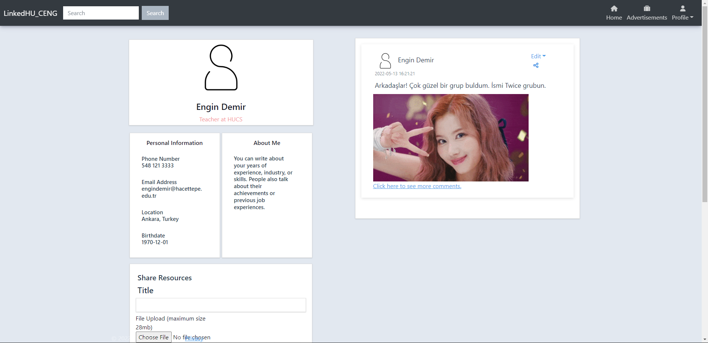
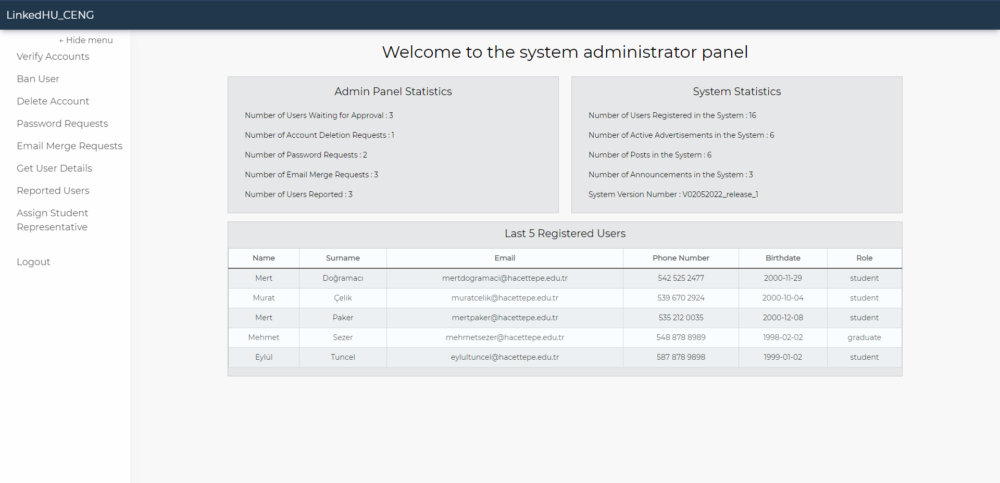

# LinkedHU_CENG Project of Exploding Gradients

LinkedHU_CENG is a full-stack web application that an online system for students (Bachelor’s students, Master students, PhD students and Exchange Students), graduates and academicians at Hacettepe University Computer Engineering Department. This system is similar in functionality to Linkedin system (www.linkedin.com). The name of our system is LinkedHU_CENG. This system is ideal system for students, graduates and academicians at Hacettepe University Computer Engineering Department looking to connect with each other.  

LinkedHU_CENG system is such platform that enables users to: enroll in the system; create their own profiles; share scholarship, job, or any other opportunities related to the industry; and track the news related to new job opportunities, online meetings, videos etc.  

While developing this system, you are expected to develop a flexible, maintainable, attractive, and extensible system.  

LinkedHU_CENG is a full-stack web application that has almost 12 critical (use cases with the CRUD (create, read, update, delete) operations) and 32 use cases at total. We have used ASP.NET programming language and ASP.NET Core framework.  

## Instructions

After you install the application, you should type some commands into the commandline of the Visual Studio.  
add-migration *a label for the migration* 
update-database  

## Design Views 

### Welcome Page

### Main Page

### Profile Page

### Administrator Console

## License Summary

bbm384-2022-demo-final-exploding-gradients created by GitHub Classroom  
This code is made available under a modified MIT license. See the LICENSE file. 
Copyright 2022 Exploding Gradients.  
© All rights reserved.
